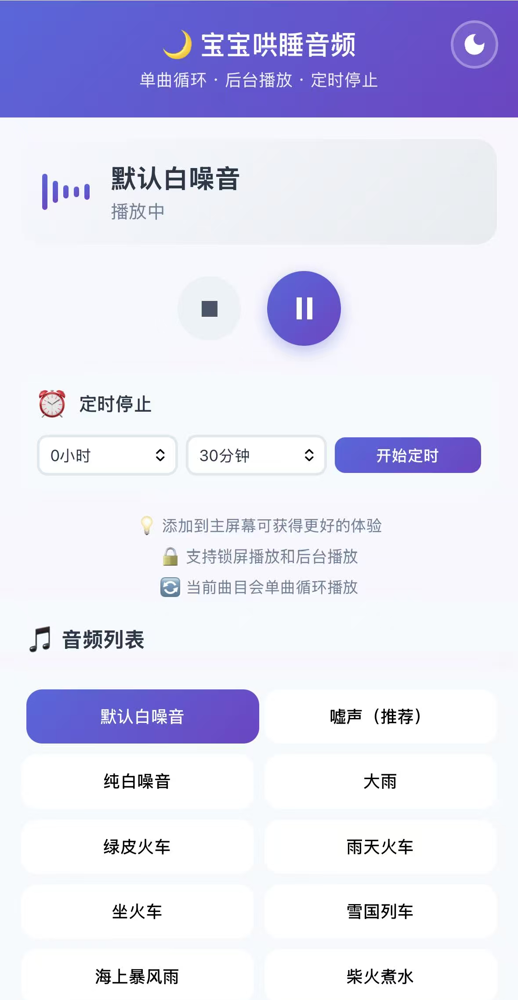

# 🌙 宝宝哄睡音频播放器

一个纯前端的Vue3音频播放器，专为宝宝哄睡设计。支持单曲循环、后台播放和锁屏控制。

## ✨ 特性

- 🔄 **单曲循环播放** - 自动循环播放选中的音频
- ⏰ **定时停止功能** - 设置播放时长，自动停止
- 🌙 **淡出模式** - 在播放结束前逐渐降低音量，避免突然停止惊醒宝宝（IOS不支持）
- 🎨 **暗黑模式** - 护眼的夜间模式，保护宝宝睡眠
- 📱 **移动端优化** - 网格布局，支持 iOS 和 Android 设备
- 🔒 **后台播放** - 支持锁屏后继续播放
- 🎵 **Media Session API** - 锁屏界面显示播放信息和控制按钮
- 💤 **防休眠功能** - 使用 Screen Wake Lock API 保持屏幕常亮
- 🌐 **支持在线音频** - 可以添加本地或在线音频URL
- 💾 **数据持久化** - 自动保存音量、主题和上次播放的音频
- 📊 **可视化进度条** - 实时显示播放进度
- 🔊 **智能音量控制** - 自动识别 iOS 设备，提供适配的使用体验

## 📸 应用截图

### iOS 界面


## 🔗 在线体验

**体验地址：** https://whmmy.github.io/baby-sleep-player/

直接在浏览器中打开即可使用，无需安装任何应用！

## 🚀 快速开始

### 启动本地服务器（必须）

由于浏览器安全限制，必须使用本地服务器运行：

```bash
cd baby-sleep-player
python -m http.server 8000
```

或者使用其他方式：

```bash
# 使用 Node.js
npx serve

# 使用 PHP
php -S localhost:8000
```

然后在浏览器访问：`http://localhost:8000`

### 在线部署

可以部署到以下平台获得更好体验：
- **GitHub Pages** - 免费，推荐
- **Vercel** - 免费且快速
- **Netlify** - 免费托管
- **Cloudflare Pages** - 全球CDN加速

## 🎵 添加音频

### 内置音频

播放器已包含以下白噪音：
- 哄睡白噪音
- 纯白噪音
- 嘘声（Shush Sound）
- 雨声系列（大雨、小雨）
- 火车系列（绿皮火车、雨天火车、坐火车、雪国列车）
- 自然声音（海上暴风雨、夏夜、露营、露营小雨）
- 舒缓声音（柴火煮水、水疗、小鸭子）

### 修改音频列表

编辑 `src/main.js` 文件，找到 `audioFiles` 数组（第7-88行）：

```javascript
const audioFiles = ref([
    {
        id: 1,
        name: '哄睡白噪音',
        url: './assets/哄睡白噪音.mp3'  // 本地音频
    },
    {
        id: 2,
        name: '雨声白噪音',
        url: 'https://example.com/rain.mp3'  // 在线音频
    },
    {
        id: 3,
        name: '海浪声',
        url: 'https://example.com/ocean.mp3'
    }
]);
```

### 音频URL格式

- **本地音频**: 使用相对路径，如 `'./assets/music.mp3'`
- **在线音频**: 使用完整URL，如 `'https://example.com/music.mp3'`
- **确保**: 每个音频有唯一的 `id`

### 支持的音频格式

- MP3 ✅
- WAV ✅
- OGG ✅
- AAC ✅
- M4A ✅

## 📱 移动端使用建议

### iOS (iPhone/iPad)

1. 在 Safari 中打开播放器
2. 点击底部的分享按钮
3. 选择"添加到主屏幕"
4. 像原生 App 一样使用

### Android

1. 在 Chrome 中打开播放器
2. 点击菜单（三个点）
3. 选择"添加到主屏幕"或"安装应用"

## ⚠️ 注意事项

### iOS 设备特别说明

⚠️ **iOS 系统限制：**
- 🔊 **音量控制**：由于 iOS 系统限制，网页无法通过 JavaScript 控制音量
  - 请使用设备侧边的**物理音量键**调节音量
  - 音量滑块在 iOS 设备上会自动隐藏
- 🔇 **静音开关**：请确保设备侧边的静音开关已关闭，否则可能没有声音
- 🌙 **淡出模式**：由于音量控制限制，iOS 设备不支持淡出模式功能

**建议使用方式：**
1. 关闭设备静音开关
2. 使用物理音量键调节到合适音量
3. 点击播放按钮开始播放
4. 设置定时停止功能

### 关于后台播放

1. **iOS Safari**
   - 需要手动点击播放按钮才能开始
   - 锁屏后会继续播放
   - 锁屏界面可使用媒体控制
   - 音量仅可通过物理按键调节

2. **Android Chrome**
   - 同样需要用户交互才能播放
   - 支持后台播放
   - 支持网页音量控制
   - 支持淡出模式功能
   - 部分设备可能有省电限制

3. **微信/QQ 内置浏览器**
   - 可能限制后台播放
   - 建议使用系统浏览器（Safari/Chrome）

### 屏幕常亮

- 需要 HTTPS 环境（localhost 除外）
- 部分旧设备可能不支持
- 低电量时系统可能强制关闭

### 淡出模式

- 淡出功能会在最后3分钟内逐渐降低音量
- 每10秒降低一次音量，直到完全停止
- 可以在设置定时后随时开启或关闭淡出模式
- 淡出模式设置会自动保存，下次使用时保持生效
- ⚠️ **iOS 设备不支持**淡出模式（由于系统音量控制限制）

## 📂 项目结构

```
baby-sleep-player/
├── index.html          # 主页面
├── src/
│   ├── main.js         # Vue 应用逻辑（在这里修改音频列表）
│   └── style.css       # 样式文件
├── assets/             # 音频文件目录
│   └── 哄睡白噪音.mp3
└── README.md           # 项目说明
```

## 🛠️ 技术栈

- **Vue 3** - 渐进式 JavaScript 框架
- **Web Audio API** - 音频播放控制
- **Media Session API** - 锁屏媒体控制
- **Screen Wake Lock API** - 屏幕常亮
- **localStorage** - 数据持久化

## 💡 使用技巧

1. **添加到主屏幕** - 更好的使用体验
2. **iOS 用户** - 使用设备侧边音量键调节音量，确保静音开关已关闭
3. **Android 用户** - 可使用网页音量滑块或淡出模式功能
4. **使用充电器** - 长时间播放建议充电
5. **开启飞行模式** - 避免来电打断
6. **启用淡出模式** - 在定时停止时逐渐降低音量（仅限 Android/PC），让宝宝更自然地进入深层睡眠
7. **使用定时功能** - 设置合适的播放时长（建议30分钟到2小时）
8. **切换暗黑模式** - 晚上使用更护眼，不影响宝宝睡眠


## 📄 许可证

MIT License - 自由使用和修改

---

💤 祝你和宝宝都能有个好梦！
